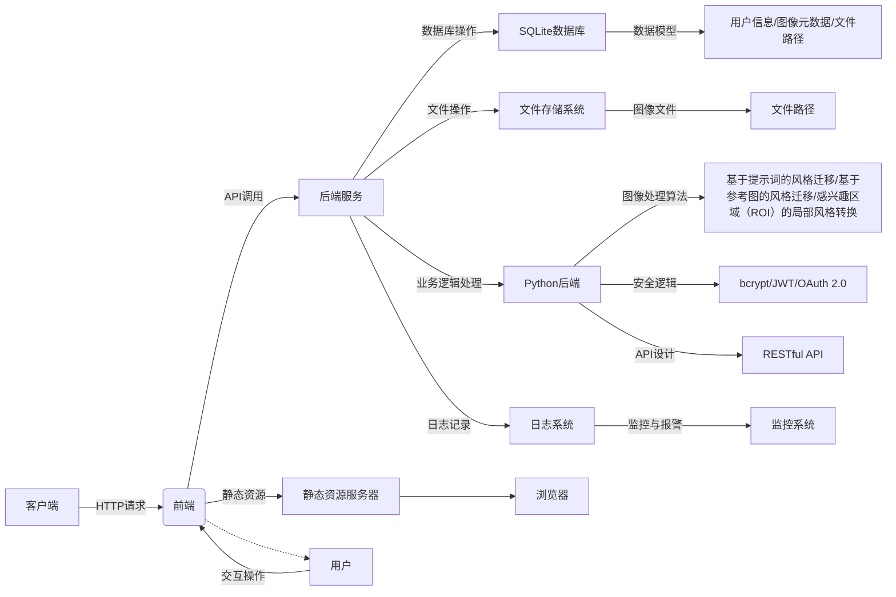

```mermaid
graph LR
    A[客户端] -->|HTTP请求| B(前端)
    B -->|API调用| C[后端服务]
    C -->|数据库操作| D[SQLite数据库]
    C -->|文件操作| E[文件存储系统]
    B -->|静态资源| F[静态资源服务器]
    F --> G[浏览器]
    B -.-> H[用户]
    H -->|交互操作| B
    C -->|业务逻辑处理| I[Python后端]
    I -->|图像处理算法| J[基于提示词的风格迁移/基于参考图的风格迁移/感兴趣区域（ROI）的局部风格转换]
    I -->|安全逻辑| K[bcrypt/JWT/OAuth 2.0]
    I -->|API设计| L[RESTful API]
    D -->|数据模型| M[用户信息/图像元数据/文件路径]
    E -->|图像文件| N[文件路径]
    C -->|日志记录| O[日志系统]
    O -->|监控与报警| P[监控系统]
```

