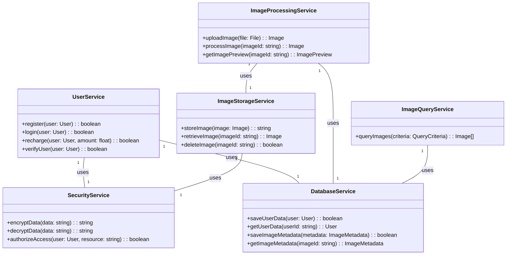

```mermaid
classDiagram
    class UserService {
        +register(user: User): boolean
        +login(user: User): boolean
        +recharge(user: User, amount: float): boolean
        +verifyUser(user: User): boolean
    }

    class ImageProcessingService {
        +uploadImage(file: File): Image
        +processImage(imageId: string): Image
        +getImagePreview(imageId: string): ImagePreview
    }

    class ImageStorageService {
        +storeImage(image: Image): string
        +retrieveImage(imageId: string): Image
        +deleteImage(imageId: string): boolean
    }

    class ImageQueryService {
        +queryImages(criteria: QueryCriteria): Image[]
    }

    class DatabaseService {
        +saveUserData(user: User): boolean
        +getUserData(userId: string): User
        +saveImageMetadata(metadata: ImageMetadata): boolean
        +getImageMetadata(imageId: string): ImageMetadata
    }

    class SecurityService {
        +encryptData(data: string): string
        +decryptData(data: string): string
        +authorizeAccess(user: User, resource: string): boolean
    }

    UserService "1" -- "1" DatabaseService : uses
    ImageProcessingService "1" -- "1" ImageStorageService : uses
    ImageProcessingService "1" -- "1" DatabaseService : uses
    ImageQueryService "1" -- "1" DatabaseService : uses
    UserService "1" -- "1" SecurityService : uses
    ImageStorageService "1" -- "1" SecurityService : uses
```